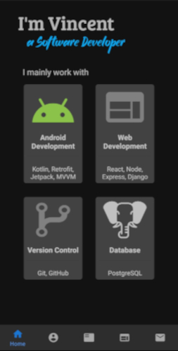
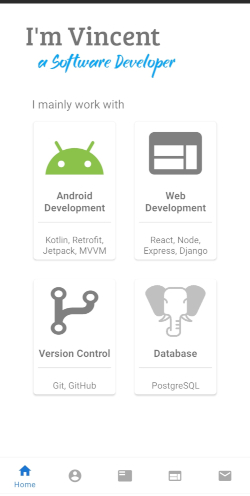

# KentLogic-App
**Android app for my portfolio.**

### Download the APK File [here](https://drive.google.com/drive/u/0/folders/1RChl7upk-fcg81uVAXxPot1jBGnKGSFh).
### Deployment on the PlayStore is ongoing (waiting for approval from Google)

  

&nbsp;&nbsp;&nbsp;&nbsp;&nbsp;&nbsp;&nbsp;&nbsp;

 
The app follows the MVVM pattern. You may view the MVVM-Template used [here](https://github.com/kentlogic/MVVM-Template).
